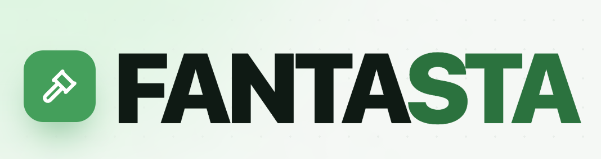

<h1 align="center">
  
</h1>

<p align="center">
  <strong>L'asta di Fantacalcio, senza caos.</strong><br>
  L'admin usa il computer. Tutti gli altri partecipano dal telefono.
</p>

<p align="center">
  <a href="https://github.com/Davide-Pirovano/FANTASTA/actions/workflows/ci.yml"></a>
  <a href="https://www.npmjs.com/package/fantasta"></a>
  <a href="https://github.com/Davide-Pirovano/FANTASTA/releases/latest"></a>
  
  
</p>

<p align="center">
  <a href="#installazione-facile-con-npx"><strong>Installa con npx</strong></a>
  ·
  <a href="#come-si-usa"><strong>Come si usa</strong></a>
  ·
  <a href="https://github.com/Davide-Pirovano/FANTASTA/releases/latest"><strong>Scarica l'app</strong></a>
  ·
  <a href="SUPPORT.md"><strong>Assistenza</strong></a>
</p>

---

Fantasta gestisce un'asta di Fantacalcio dal vivo, dall'inizio alla fine:

- crea la lega e imposta crediti, ruoli e timer;
- importa il listone Excel;
- fa entrare i partecipanti con un QR code, senza account;
- aggiorna offerte, crediti e rose in tempo reale;
- assegna automaticamente il calciatore allo scadere del timer;
- esporta rose e risultati finali.

> Serve un solo computer con Fantasta: quello dell'admin. I partecipanti non devono installare nulla e si collegano dal browser, purché siano sulla stessa rete Wi-Fi.

## Installazione facile con npx

Questo è il modo più semplice per usare Fantasta. `npx` scarica e apre automaticamente l'app, senza installarla come programma di sistema. Non devi scaricare il progetto, configurare database o conoscere Docker.

### 1. Installa Node.js

Sul computer dell'admin deve essere presente **Node.js 22.13 o una versione più recente**.

1. Apri [nodejs.org/download](https://nodejs.org/en/download).
2. Scarica la versione **LTS** per il tuo computer.
3. Installa Node.js lasciando le opzioni già selezionate.

Per controllare che sia tutto pronto, apri:

- **Terminale** su macOS;
- **PowerShell** o **Terminale** su Windows.

Poi scrivi:

```bash
node --version
```

Se compare `v22.13.0` o un numero più alto, puoi continuare. Se il comando non viene riconosciuto, chiudi e riapri il terminale dopo aver installato Node.js.

### 2. Avvia Fantasta

Nello stesso terminale scrivi:

```bash
npx fantasta@latest
```

La prima volta il download può richiedere qualche minuto. Se compare la domanda `Ok to proceed?`, scrivi `y` e premi Invio. Al termine si aprirà Fantasta.

### 3. Per riaprirlo in futuro

Usa sempre lo stesso comando:

```bash
npx fantasta@latest
```

Non serve ripetere l'installazione di Node.js.

> Su macOS Fantasta continua a funzionare nella sua finestra e il terminale torna libero. Su Windows e Linux lascia aperto il terminale mentre usi l'app. Per spegnere Fantasta, chiudi la finestra dell'app.

## Come si usa

### Sul computer dell'admin

1. Collega il computer e i telefoni dei partecipanti alla **stessa rete Wi-Fi**.
2. Avvia Fantasta e scegli **Crea asta**.
3. Inserisci nome della lega, squadre, crediti, posti per ruolo e durata del timer.
4. Carica il listone Excel di **FantaMaster** o **Leghe Fantacalcio**.
5. Mostra il **QR code** della lobby ai partecipanti.
6. Quando tutti sono entrati, avvia l'asta.
7. Usa la regia per chiamare i calciatori, controllare le offerte, mettere in pausa o correggere un'aggiudicazione.
8. Alla fine esporta le rose e salva un backup dell'asta.

Puoi scegliere tra due modalità:

- **Per ruoli**: prima portieri, poi difensori, centrocampisti e attaccanti.
- **Ordine sparso**: puoi chiamare calciatori di qualsiasi ruolo.

### Sul telefono dei partecipanti

1. Scansiona il QR code mostrato dall'admin.
2. Scegli il nome della tua squadra.
3. Fai le offerte dal browser.

Non servono app, account o registrazioni. Dalla schermata personale puoi controllare crediti, acquisti, rosa e squadre avversarie.

## Uno sguardo all'app

Fai clic su uno screenshot per aprirlo a dimensione intera.

<table>
  <tr>
    <td width="70%" align="center">
      <a href="apps/web/public/screenshots/admin-desktop.png">
        
      </a>
      <br><strong>Regia dell'admin</strong><br>
      Controllo dell'asta e rose aggiornate in tempo reale.
    </td>
    <td width="30%" align="center">
      <a href="apps/web/public/screenshots/participant-mobile.png">
        
      </a>
      <br><strong>Vista partecipante</strong><br>
      Offerte rapide direttamente dal telefono.
    </td>
  </tr>
</table>

<p align="center">
  <a href="apps/web/public/screenshots/setup-wizard.png">
    
  </a>
  <br><strong>Configurazione guidata</strong><br>
  Tutti i passaggi per preparare la lega prima dell'asta.
</p>

## Cosa può fare Fantasta

- **Asta in tempo reale** con countdown che riparte a ogni rilancio e aggiudicazione automatica.
- **Controllo dei crediti e degli slot** per impedire offerte non valide.
- **Lobby con QR code** per far entrare tutti velocemente.
- **Rose sempre aggiornate** per admin e partecipanti.
- **Svincoli** con rimborso configurabile: prezzo pieno, metà, 1 credito, quotazione o nessun rimborso.
- **Asta di riparazione** partendo da una lega già salvata o da un export precedente.
- **Rientro facile** se qualcuno chiude per errore la pagina o perde la connessione.
- **Backup ed export Excel** per non perdere i risultati.

I dati dell'asta restano sul computer dell'admin. Durante l'asta non serve un server esterno: telefoni e computer comunicano attraverso la rete locale.

## In alternativa: scarica l'app desktop

Se preferisci un normale installer, scarica il file adatto al computer dell'admin:

| Computer | File da scaricare |
|---|---|
| macOS con chip Apple | [Fantasta-arm64.dmg](https://github.com/Davide-Pirovano/FANTASTA/releases/latest/download/Fantasta-arm64.dmg) |
| macOS con processore Intel | [Fantasta-x64.dmg](https://github.com/Davide-Pirovano/FANTASTA/releases/latest/download/Fantasta-x64.dmg) |
| Windows 64 bit | [Fantasta-x64.exe](https://github.com/Davide-Pirovano/FANTASTA/releases/latest/download/Fantasta-x64.exe) |

Non sai quale versione scegliere? Apri la pagina delle [Release](https://github.com/Davide-Pirovano/FANTASTA/releases/latest) e leggi le note dell'ultima versione.

Gli installer potrebbero mostrare un avviso se la versione non è firmata:

- **macOS**: trascina Fantasta in Applicazioni; al primo avvio fai `Ctrl + clic` sull'app e scegli **Apri**.
- **Windows**: nell'avviso SmartScreen scegli **Maggiori informazioni**, poi **Esegui comunque**. Fallo solo se hai scaricato il file da questo repository.

I partecipanti continuano a entrare dal browser: l'installer serve soltanto sul computer dell'admin.

## Come disinstallare Fantasta

Prima di iniziare, esporta dall'app un backup se vuoi conservare leghe, rose e risultati.

### Se lo hai avviato con npx

`npx` non aggiunge Fantasta all'elenco dei programmi installati. Per smettere di usarlo basta chiudere l'app e non eseguire più il comando.

Fantasta conserva database, sessioni e log nella cartella nascosta `.fantasta` del tuo utente. **Cancella questa cartella solo se vuoi eliminare definitivamente anche tutte le aste salvate.**

- **macOS**: nel Finder scegli **Vai → Vai alla cartella…**, scrivi `~/.fantasta` e sposta la cartella nel Cestino.
- **Windows**: nella barra di Esplora file scrivi `%USERPROFILE%\.fantasta` e cancella la cartella.
- **Linux**: apri la cartella Home, mostra i file nascosti con `Ctrl + H` e cancella `.fantasta`.

Il pacchetto scaricato da `npx` può restare nella cache di npm: è un file temporaneo, non si avvia da solo e può essere lasciato lì senza problemi.

Se invece avevi scelto un'installazione globale con npm, rimuovila con:

```bash
npm uninstall --global fantasta
```

Poi elimina `.fantasta` soltanto se vuoi cancellare anche i dati.

### Se hai usato l'installer

- **macOS**: chiudi Fantasta, apri Applicazioni e sposta Fantasta nel Cestino.
- **Windows**: apri **Impostazioni → App → App installate**, cerca Fantasta e scegli **Disinstalla**.

Anche in questo caso, la cartella `.fantasta` rimane per proteggere le aste salvate. Puoi conservarla per una futura reinstallazione oppure eliminarla seguendo i passaggi precedenti.

## Problemi comuni

<details>
<summary><strong>Il telefono non riesce a collegarsi</strong></summary>

- Controlla che telefono e computer siano sulla stessa rete Wi-Fi.
- Evita le reti “Guest/Ospiti”: spesso impediscono ai dispositivi di comunicare tra loro.
- Se il computer chiede se Fantasta può accettare connessioni dalla rete, scegli **Consenti**.
- Disattiva temporaneamente VPN o hotspot che potrebbero cambiare la rete usata.
- Torna alla lobby e rigenera il QR code se il computer si è collegato a un'altra rete.

</details>

<details>
<summary><strong>Il comando npx non viene riconosciuto</strong></summary>

Node.js non è installato oppure il terminale era già aperto durante l'installazione. Installa Node.js dalla [pagina ufficiale](https://nodejs.org/en/download), poi chiudi e riapri Terminale o PowerShell.

</details>

<details>
<summary><strong>Fantasta non parte o una porta è già occupata</strong></summary>

Chiudi eventuali altre finestre di Fantasta e riprova. Se il problema continua, puoi usare due porte diverse:

```bash
FANTASTA_PORT=49001 FANTASTA_RENDERER_PORT=49002 npx fantasta@latest
```

Su Windows PowerShell:

```powershell
$env:FANTASTA_PORT=49001
$env:FANTASTA_RENDERER_PORT=49002
npx fantasta@latest
```

</details>

Per altro aiuto consulta [SUPPORT.md](SUPPORT.md) o apri una issue descrivendo il computer usato e ciò che compare sullo schermo.

<details>
<summary><strong>Informazioni per sviluppatori</strong></summary>

## Avvio del progetto in locale

Requisiti: Node.js 22, Docker Desktop e `make`.

```bash
npm ci
make up
```

`make up` avvia Supabase e la web app, prepara l'ambiente locale e apre [http://localhost:3000](http://localhost:3000).

| Comando | Cosa fa |
|---|---|
| `make up` | Avvia tutto e apre il browser |
| `make dev` | Avvia lo sviluppo con aggiornamento automatico |
| `make down` | Ferma tutti i servizi |
| `make status` | Mostra lo stato dei servizi |
| `make logs` | Mostra i log della web app |
| `make reset-db` | Ricrea il database locale |
| `npm run verify` | Esegue lint, controllo tipi e test |
| `npm run desktop:package` | Crea l'installer per il sistema corrente |

### Tecnologie principali

| Parte | Tecnologia |
|---|---|
| Interfaccia | Next.js, React e Tailwind CSS |
| App desktop | Electron e SQLite |
| Modalità web | PostgreSQL e Supabase |
| Import/export | File Excel `.xlsx` |

### Struttura del repository

```text
apps/web/          interfaccia web condivisa
apps/desktop/      app desktop e server locale
cli/               pacchetto pubblicato su npm
packages/          logica e contratti condivisi
supabase/          schema e migrazioni della modalità web
infra/docker/      immagini Docker
docs/              architettura e documentazione tecnica
```

Approfondimenti: [architettura](docs/ARCHITECTURE.md) · [piano desktop](docs/DESKTOP_PLAN.md) · [pubblicazione delle release](docs/RELEASING.md) · [contribuire](CONTRIBUTING.md).

</details>

## Sicurezza, privacy e progetto

- [Privacy](PRIVACY.md)
- [Sicurezza](SECURITY.md)
- [Changelog](CHANGELOG.md)
- [Supporto](SUPPORT.md)
- [Come contribuire](CONTRIBUTING.md)

Il repository è pubblico, ma al momento non contiene ancora un file `LICENSE`. In assenza di una licenza esplicita, il codice resta soggetto ai diritti esclusivi dell'autore.
