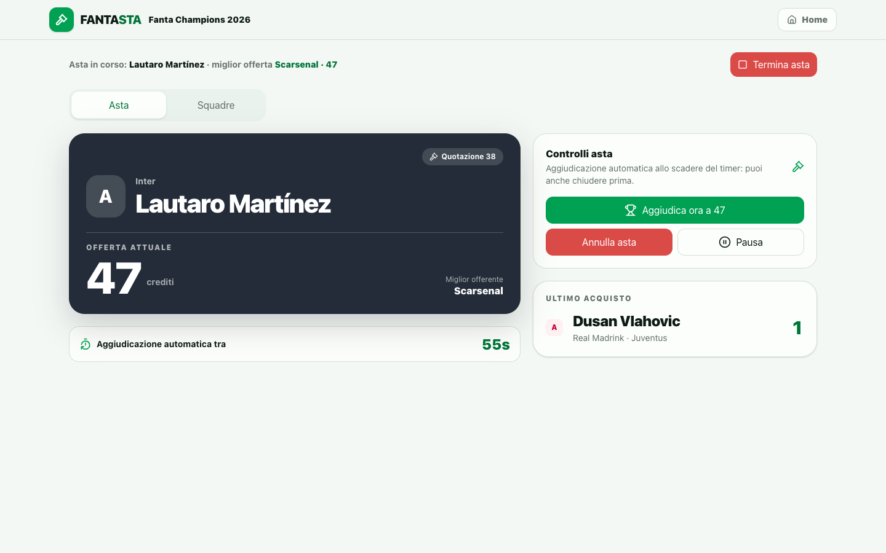
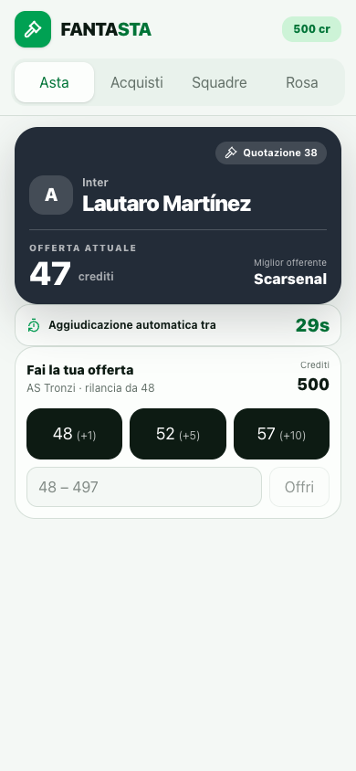
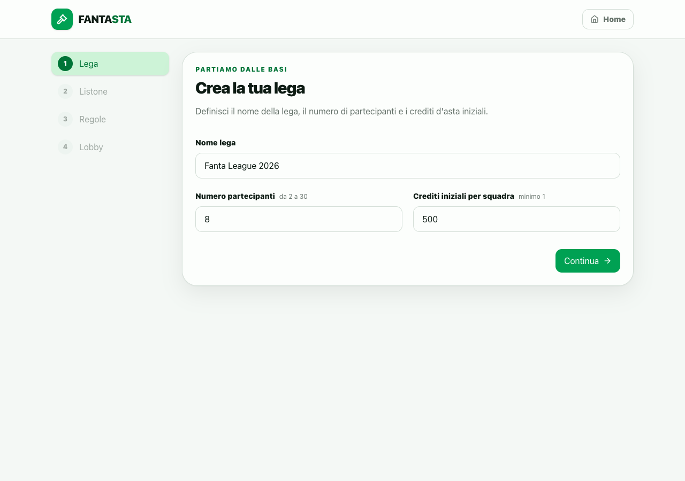

# Fantasta

[](https://github.com/Davide-Pirovano/FANTASTA/actions/workflows/ci.yml)
[](https://github.com/Davide-Pirovano/FANTASTA/releases/latest)
[](#scarica-lapp-desktop)
[](#scarica-lapp-desktop)

**L'asta di Fantacalcio, senza caos.** Web app mobile-first per gestire aste di Fantacalcio in tempo reale, pensata per essere usata dal vivo: l'admin dirige da PC, i partecipanti giocano dal telefono (anche tramite QR).

L'intero flusso è coperto: **creazione lega → import listone Excel → regole → lobby con QR → asta live → costruzione rose → gestione crediti → export dei risultati finali.**

> **Desktop:** l'admin installa Fantasta su macOS o Windows; i partecipanti non installano nulla e si collegano dal browser sulla stessa rete Wi-Fi. I dati restano sul PC dell'admin.

[Scarica l'ultima versione](https://github.com/Davide-Pirovano/FANTASTA/releases/latest) · [Changelog](CHANGELOG.md) · [Supporto](SUPPORT.md) · [Privacy](PRIVACY.md) · [Sicurezza](SECURITY.md)

## Funzionalità

- **Wizard di setup** — nome lega, numero partecipanti, crediti iniziali, slot per ruolo (P/D/C/A), offerta minima, timer di aggiudicazione e politica di **svincolo** (rimborso pieno, metà crediti o 1 credito).
- **Import listone Excel** — formato ufficiale FantaMaster (`.xlsx` con foglio *Tutti* o per ruolo): nome, squadra, ruolo, quotazione e trequartisti estratti automaticamente.
- **Lobby con QR** — i partecipanti entrano scansionando il QR (o copiando il link) direttamente da telefono, senza registrazione.
- **Asta live in tempo reale con due modalità a scelta** — **per ruoli**: prima i portieri, poi difensori, centrocampisti e attaccanti, si chiamano solo i giocatori del ruolo di fase e solo chi ha ancora slot liberi, con avanzamento automatico; oppure **ordine sparso**: si chiama qualsiasi ruolo, il turno gira tra chi ha ancora posti liberi in rosa. In entrambe, chi chiama parte subito come miglior offerente alla base d'asta; parte un countdown che si azzera a ogni rilancio e **allo scadere il giocatore viene aggiudicato in automatico** al miglior offerente (deciso dal server, non dal client).
- **Vista partecipante mobile-first** — 4 tab: *Asta · Acquisti · Squadre · Rosa*, con pallino di notifica quando è il tuo turno.
- **Regia da PC** — controllo dell'asta (aggiudica ora, annulla, pausa, termina), rose di tutte le squadre in colonne aggiornate in tempo reale (con svincolo da regia), export Excel dei risultati.
- **Svincolo giocatori** — un acquisto può essere svincolato (dal partecipante nella propria rosa o dalla regia per qualsiasi squadra): il giocatore torna disponibile, lo slot si libera e i crediti di rimborso seguono la regola scelta (prezzo pieno, metà arrotondata per eccesso con minimo 1, 1 credito, quotazione del listone oppure 0 crediti). Lo svincolo è sempre possibile, la politica decide solo quanti crediti tornano in cassa. Gli acquisti svincolati restano nello storico con il badge *Svincolato*.
- **Asta di riparazione** — parte da un'asta conclusa salvata oppure dall'Excel *Export lega completa*. Importa il nuovo listone, conserva rose e crediti residui (o assegna una quota uguale), gestisce separatamente i calciatori fuori listone e permette gli svincoli preparatori già in lobby. Le regole disponibili sono 1 credito, metà del prezzo, prezzo pieno o quotazione del listone.
- **Rientro dopo una chiusura accidentale** — se un partecipante perde la sessione, rientra nella propria squadra con il solo nome (anche ad asta già partita).
- **Offerte atomiche e sicure** — ogni offerta è validata e serializzata lato database (budget, ruoli, slot) nella stessa transazione; RLS attivo su tutte le tabelle.

## Screenshot



*Regia per l'admin su desktop: controllo dell'asta e rose aggiornate in tempo reale.*



*Vista partecipante su telefono, ottimizzata per offerte rapide.*



*Configurazione guidata della lega: impostazioni iniziali, listone, regole e lobby.*

## Compatibilità: FantaMaster e Leghe Fantacalcio

L'import del listone accetta i file Excel esportati dai due strumenti più usati per i Fantacalcio: **FantaMaster** e **Leghe Fantacalcio** (per le Trequarti e la Serie B)*. In entrambi i casi il file è un `.xlsx` (foglio *Tutti*, oppure i fogli *Portieri · Difensori · Centrocampisti · Attaccanti* per l'import per ruolo).

**Come scaricare la lista dei giocatori:**

- **FantaMaster** — esporta il listone come Excel (file `.xlsx`): il formato ufficiale include per ogni giocatore nome, squadra reale, ruolo, quotazione e l'indicazione dei trequartisti, che l'app legge automaticamente.
- **Leghe Fantacalcio** — esporta allo stesso modo la lista completa dei giocatori, con ruolo e quotazione.

*Le quotazioni corrispondono al valore con cui i giocatori vengono messi all'asta (base d'asta/valutazione).* L'app legge solo i campi che le servono (nome, squadra, ruolo, quotazione) e ignora il resto, quindi è tollerante alle piccole differenze di versione del file: se un formato dovesse non essere riconosciuto, basterà aprirlo in Excel e risalvarlo come `.xlsx` standard.

Una volta caricato, il listone non viene salvato: i giocatori vengono estratti e caricati nel database solo per l'asta che stai per creare. L'ordinamento della lista (per valutazione o per squadra) è selezionabile durante la chiamata.

## Stack

| Componente | Tecnologia |
|---|---|
| App | Next.js (App Router, `output: standalone`) + React + Tailwind |
| Database | PostgreSQL + Supabase (Auth anonima, Realtime, RPC) |
| Infrastruttura locale | Docker + Docker Compose + Supabase CLI |
| Excel | `read-excel-file` / `write-excel-file` (lazy-loaded) |

Il repository è organizzato come monorepo npm e mantiene due modalità di distribuzione chiaramente separate:

- **Web (disponibile)** — l'app attuale in `apps/web`, avviabile via Docker e accessibile da PC e smartphone sulla LAN.
- **Desktop (disponibile)** — app macOS/Windows in `apps/desktop`: shell Electron con database SQLite incorporato (niente Docker né Supabase). L'admin dirige dalla finestra desktop, i partecipanti giocano dal browser sulla stessa LAN tramite QR o link. Il renderer Next e il server locale sono inclusi nel pacchetto installabile (`.dmg` su macOS, `.exe`/NSIS su Windows).

Le due modalità condividono interfaccia e logica di dominio tramite i package `domain` e `contracts`; non si escludono a vicenda.

## Scarica l'app desktop

L'app desktop è pensata per l'asta dal vivo senza Docker: si installa sul **PC dell'admin** (`Fantasta-arm64.dmg`/`Fantasta-x64.dmg` su macOS, `Fantasta-x64.exe` su Windows), apre la regia in una finestra Electron e serve partecipanti, QR e link direttamente sulla LAN. **I partecipanti non installano nulla**: entrano dal browser del telefono/PC scansionando il QR o aprendo il link. Chi preferisce può usare la stessa app desktop anche **come partecipante**: dalla home c'è "Accedi alla lega", si incolla il link di invito (quello del QR / "Copia link") e si entra nella lega dell'admin sulla stessa rete.

> I link sottostanti puntano sempre all'ultima release completata. Dopo la creazione di un nuovo tag possono richiedere alcuni minuti, il tempo necessario alla CI per compilare e caricare gli installer.

| Sistema | Architecture | Download |
|---|---|---|
| **macOS** | Apple Silicon | [Fantasta-arm64.dmg](https://github.com/Davide-Pirovano/FANTASTA/releases/latest/download/Fantasta-arm64.dmg) |
| **macOS** | Intel | [Fantasta-x64.dmg](https://github.com/Davide-Pirovano/FANTASTA/releases/latest/download/Fantasta-x64.dmg) |
| **Windows** | 64-bit | [Fantasta-x64.exe](https://github.com/Davide-Pirovano/FANTASTA/releases/latest/download/Fantasta-x64.exe) |

Non trovi il tuo caso? Apri la pagina delle [Release](https://github.com/Davide-Pirovano/FANTASTA/releases) e scegli l'installer esatto dalla versione che preferisci.

### Note di installazione

- **Stato firma:** gli installer possono essere prodotti senza firma/notarizzazione se i certificati non sono configurati nella CI. In quel caso macOS Gatekeeper o Windows SmartScreen mostreranno un avviso. La pagina della singola release indica lo stato effettivo.
- **macOS, build non notarizzata:** trascina Fantasta in Applicazioni, poi usa *Ctrl+click* sull'app e scegli **Apri** al primo avvio.
- **Windows, build non firmata:** verifica di aver scaricato l'installer da questo repository, quindi usa *Maggiori informazioni* e *Esegui comunque* nell'avviso SmartScreen.
- L'app funziona **offline e in locale**, senza account né server esterni; il database dell'asta viene salvato sul tuo PC (backup esportabile dalla regia).
- L'invito ai partecipanti avviene tramite QR/link sulla stessa rete Wi-Fi.

Ogni release include `SHA256SUMS.txt`. Per verificare il download:

```bash
# macOS
shasum -a 256 Fantasta-arm64.dmg

# Windows PowerShell
Get-FileHash .\Fantasta-x64.exe -Algorithm SHA256
```

**Nota per iPhone/iPad (iOS):** non esiste un installer mobile. I partecipanti da iPhone/iPad/Android accedono semplicemente dal **browser** scansionando il QR o aprendo il link condiviso dal PC dell'admin — nessuna installazione o registrazione richiesta.

Se ti serve l'installer per un'altra piattaforma o vuoi eseguire dal sorgente: `git clone <repo> && npm ci && npm run desktop:package` (vedi sotto).

### Installare l'app desktop con npx/npm (senza installer, niente avvisi di sicurezza)

Vuoi la **vera app desktop** ma senza scaricare il .dmg/.exe? Si installa da npm con **Node.js ≥ 22**:

```bash
npx fantasta
```

> Al primo avvio npm scarica il pacchetto insieme al binario Electron (~120 MB, solo la prima volta). Poi si apre la **vera finestra dell'app**: server SQLite/LAN su porta `47821`, renderer su `47822`, partecipanti dal telefono come sempre (QR/link). Dati e sessioni persistono in `~/Library/Application Support/Fantasta` (macOS) / `~/.fantasta/` (altre piattaforme). `Ctrl+C` nel terminale chiude l'app.

**Perché niente avvisi di sicurezza?** L'avviso *"app scaricata da internet"* (Gatekeeper su macOS, SmartScreen su Windows) compare solo sui file scaricati dal **browser**, che macOS/Windows marcano come "quarantena". npm scarica i pacchetti con le sue librerie, **senza quel flag**: il binario Electron incluso è firmato da GitHub e non viene mai segnalato come scaricato dal browser. L'app quindi parte sempre senza dialoghi, anche su un computer che non l'ha mai vista. (Gli installer `.dmg`/`.exe` della sezione sopra invece arrivano dal browser e possono chiedere l'autorizzazione la prima volta se non firmati.)

Installazione globale (menu Avvio/Applicazioni + comando `fantasta`):

```bash
npm install -g fantasta && fantasta
```

Porte occupate? Cambiale con le variabili d'ambiente:

```bash
FANTASTA_PORT=49001 FANTASTA_RENDERER_PORT=49002 npx fantasta
```

Preferisci la regia nel browser invece della finestra? Aggiungi `--browser`:

```bash
npx fantasta --browser
```

## Modalità desktop (sviluppo)

```bash
# sviluppo (due terminali)
npm run desktop:renderer   # renderer Next esposto alla LAN
npm run desktop:electron   # finestra Electron + server SQLite/LAN

# pacchetto installabile per la piattaforma corrente
npm run desktop:package    # web:build + bundle server + electron-builder
```

L'artefatto finisce in `apps/desktop/release/` con il nome fisso `Fantasta-<arch>.dmg` (es. `Fantasta-arm64.dmg`) o `Fantasta-<arch>.exe`. Il database vive in `~/.fantasta/fantasta.db` (sovrascrivibile con `FANTASTA_DATABASE_PATH`); il QR del wizard punta automaticamente all'IP locale del PC, i partecipanti entrano dal browser del telefono. Le build macOS e Windows firmate/notarizzate vengono prodotte dalla GitHub Action `.github/workflows/release-desktop.yml` al push di un tag `v*` (firma e notarizzazione richiedono i certificati nei secret del repository).

**Stato e limiti**: la catena funzionale copre setup, SQLite, LAN, partecipanti, asta, backup e ripristino. La CI produce build macOS Apple Silicon, macOS Intel e Windows x64. Firma Apple, notarizzazione e firma Windows dipendono dalla presenza dei relativi certificati; non vengono dichiarate come attive se non verificate sulla singola release. Restano da completare la diagnostica LAN guidata, un test E2E multi-dispositivo su hardware reale e gli aggiornamenti automatici. Dettagli in `docs/DESKTOP_PLAN.md`.

La procedura usata per versionare, verificare e pubblicare gli installer è documentata in [`docs/RELEASING.md`](docs/RELEASING.md).

## Avvio rapido (locale, in Docker)

**Prerequisiti:** Node 22, Docker Desktop installato, `make`.

```bash
npm ci
make up
```

**Un solo comando per tutto**: se Docker Desktop è spento lo apre da solo e attende il daemon, poi avvia i container Supabase, applica le migrazioni, genera `.env.local` con le chiavi locali, compila/avvia l'app Next.js e **apre il browser su http://localhost:3000** quando l'app risponde. Niente più passi manuali.

| Servizio | URL |
|---|---|
| Web App | http://localhost:3000 |
| Supabase Studio | http://localhost:54323 |
| Supabase API | http://localhost:54321 |

Poi apri `/setup`: crea la lega, importa il listone e partecipa con un secondo dispositivo. Su un telefono della **stessa Wi-Fi**, il QR e i link di invito usano automaticamente l'IP locale del Mac (rilevato dal browser) al posto di `localhost`.

## Comandi

| Comando | Descrizione |
|---|---|
| `make up` | **One-shot**: apre Docker se spento, avvia Supabase + Web App e apre il browser |
| `make start` | Alias di `make up` |
| `make dev` | Supabase in Docker + Next.js in dev mode con hot-reload |
| `make down` | Ferma tutti i container |
| `make restart` | Riavvia completamente lo stack |
| `make status` | Stato dei container e dei servizi Supabase |
| `make logs` | Log dell'app Next.js |
| `make reset-db` | Ripristina il DB locale riapplicando tutte le migrazioni |
| `make studio` | Apre Supabase Studio |
| `npm test` | Test dei package condivisi (`domain` e `contracts`) |
| `npm run verify` | Quality gate completo: lint, typecheck e tutti i test |

Sviluppo manuale: `npx supabase start && ./scripts/setup-local-env.sh && npm run dev`.

### Risoluzione problemi: "il telefono non si connette"

1. **Lo stack è acceso?** Se Docker Desktop è chiuso nessuna porta risponde. Controlla con `make status` e riavvia con `make up`.
2. **Stessa rete?** L'IP del telefono deve avere lo stesso prefisso del Mac (es. `192.168.1.x`). Le reti guest con isolamento client bloccano la connessione.
3. **IP corretto nel QR?** Se il Mac cambia IP (DHCP) ricarica la pagina della regia per rigenerare il QR. Con VPN o rilevamento fallito usa **"Usa un URL diverso"** e inserisci l'IP a mano.

## Variabili d'ambiente

Tutte le variabili sono documentate in `.env.example`; in locale vengono generate da `scripts/setup-local-env.sh`. Lo script scrive l'ambiente dello stack alla radice e `apps/web/.env.local` per Next.js in modalità sviluppo.

| Variabile | Descrizione |
|---|---|
| `NEXT_PUBLIC_SUPABASE_URL` | URL di Supabase (in locale `http://127.0.0.1:54321`) — **usata a build time** |
| `NEXT_PUBLIC_SUPABASE_PUBLISHABLE_KEY` | Chiave `anon` pubblica |
| `SUPABASE_SERVICE_ROLE_KEY` | Chiave `service_role` (solo lato server: export, test E2E) |
| `SUPABASE_SERVER_URL` | URL usato dal server Next.js per Supabase. In Docker è impostato a `http://host.docker.internal:54321`; in produzione coincide con `NEXT_PUBLIC_SUPABASE_URL` |
| `NEXT_PUBLIC_APP_URL` | URL pubblico dell'app |

`.env` e `.env.local` sono esclusi da git (`.gitignore`): non committare mai le chiavi.

## Deploy (produzione)

### Opzione A — Supabase Cloud + Vercel (consigliata, gratis)

Il database, l'auth e il realtime passano nel cloud: i telefoni si collegano da qualsiasi rete, senza Docker e senza Wi-Fi locale.

1. Crea un progetto su [supabase.com](https://supabase.com) (free tier).
2. Collega le migrazioni (già pronte in `supabase/migrations/`):
   ```bash
   supabase link --project-ref <project-ref>
   supabase db push
   ```
3. **Attiva gli accessi anonimi**: Authentication → Sign In / Up → *Anonymous Sign-Ins* (l'app usa `signInAnonymously()`, nei progetti cloud è disattivato di default).
4. Imposta le variabili d'ambiente con i valori del progetto cloud:
   - `NEXT_PUBLIC_SUPABASE_URL=https://<ref>.supabase.co`
   - `NEXT_PUBLIC_SUPABASE_PUBLISHABLE_KEY=<anon key>`
   - `SUPABASE_SERVER_URL=https://<ref>.supabase.co`
   - `SUPABASE_SERVICE_ROLE_KEY=<service_role key>`
5. Hosting dell'app: **Vercel** (importa il repo, imposta le stesse variabili; HTTPS automatico) oppure un VPS.

Nessuna modifica al codice: quando la pagina è servita da un dominio reale, il QR punta al dominio e il rilevamento IP locale diventa inattivo.

### Opzione B — VPS self-hosted

Un VPS (Hetzner, DigitalOcean…) con Docker: Supabase self-hosted (compose ufficiale di Supabase) + il container dell'app dietro un reverse proxy con HTTPS (Caddy/Nginx). Più controllo, ma aggiornamenti e backup sono a carico tuo.

### Opzione C — Solo locale

Per un'asta dal vivo tra amici sulla stessa Wi-Fi l'impostazione Docker locale è già quella giusta: `make up` e via.

## Test

```bash
npm run typecheck   # controllo dei tipi
npm run lint        # ESLint
node --env-file=.env.local scripts/e2e-auction-flow.ts   # E2E del motore asta contro Supabase locale
```

L'E2E verifica l'intero flusso reale (nessun mock): creazione lega, import, join ×2, nomina con base d'asta al chiamante, offerte valide/non valide, aggiudicazione manuale, scadenza timer con aggiudicazione automatica, annullamento, rollback e rientro dopo perdita di sessione.

## Struttura del progetto

```text
apps/
  web/                # Prodotto Next.js attuale: route, componenti, hook e accesso Supabase
  desktop/            # App Electron macOS/Windows: server SQLite/LAN, shell, packaging
packages/             # Moduli condivisi: domain/contracts attivi, altri adapter pianificati
infra/
  docker/             # Immagini Docker della modalità web
supabase/
  migrations/         # Schema PostgreSQL, RLS e RPC della modalità web
scripts/              # Avvio locale, ambiente ed E2E
docs/
  ARCHITECTURE.md      # Architettura web attuale
  BACKEND_CONTRACT.md  # RPC, invarianti e requisiti di parità SQLite
  DESKTOP_PLAN.md      # Architettura target e fasi della modalità desktop
  RELEASING.md         # Checklist di versione, firma e pubblicazione installer
docker-compose.yml    # Entrypoint Docker mantenuto alla radice
Makefile              # Comandi brevi: make up, dev, down, test
```

I comandi npm eseguiti dalla radice vengono inoltrati al workspace `@fantasta/web`, quindi `npm run dev`, `npm run build`, `npm run lint` e `npm run typecheck` restano invariati.

## Architettura

I punti chiave sono descritti in `docs/ARCHITECTURE.md`; la strategia desktop separata è in `docs/DESKTOP_PLAN.md`. In sintesi:

- **Offerte atomiche**: `place_bid` blocca la riga dell'asta e valida budget/ruolo/slot nella stessa transazione.
- **Aggiudicazione automatica**: `auctions.bid_deadline` è decisa dal server; `resolve_auction` è idempotente e race-safe (la prima chiamata vince).
- **Realtime con RLS**: il client propaga la sessione prima della subscribe e le tabelle hanno `REPLICA IDENTITY FULL` (migrazione `202608270004`).
- **Rientro partecipanti**: `rejoin_league` riassegna la sessione corrente alla squadra tramite il nome squadra, anche ad asta già partita.

## Affidabilità e supporto

- La workflow `CI` verifica ogni push su `main` e ogni pull request con lint, typecheck, test e build.
- La pipeline desktop pubblica una release soltanto se il tag coincide con la versione del pacchetto.
- Ogni release contiene checksum SHA-256 degli installer.
- I problemi comuni e le informazioni necessarie per una segnalazione sono in [SUPPORT.md](SUPPORT.md).
- Le vulnerabilità devono essere segnalate privatamente seguendo [SECURITY.md](SECURITY.md).
- Il trattamento dei dati nelle modalità desktop e web è descritto in [PRIVACY.md](PRIVACY.md).
- Le regole per proporre modifiche sono in [CONTRIBUTING.md](CONTRIBUTING.md).

## Licenza

Il repository non contiene ancora una licenza open source. In assenza di un file `LICENSE`, il codice resta soggetto ai diritti esclusivi dell'autore. Prima di accettare contributi esterni o promuovere il progetto come open source va scelta e aggiunta una licenza esplicita.
